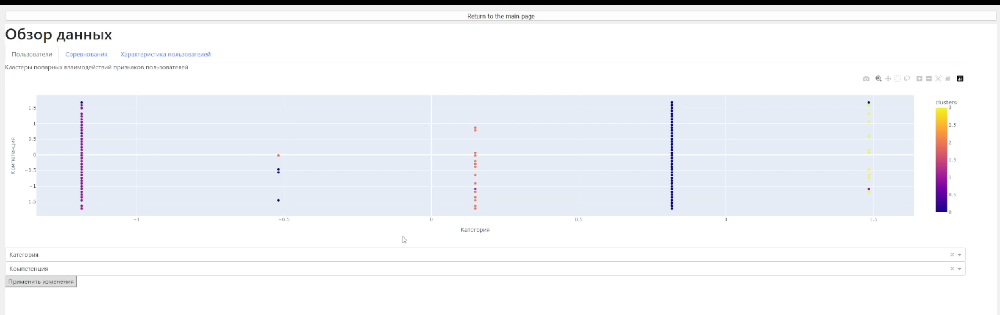
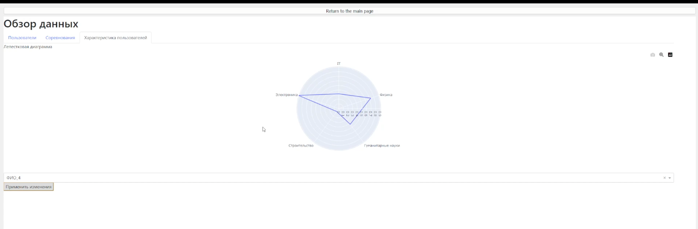

# RosAtomHack

## Задача:
«AtomSkills» – отраслевой чемпионат профессионального мастерства Госкорпорации «Росатом», который проводится c 2016 года. Это масштабное отраслевое чемпионатное движение, объединяющее все конкурсы профессионального мастерства, проводимые в атомной отрасли. Актуальной проблемой является большое разнообразие данных о пользователях, которые поступают как при регистрации на чемпионат, так и по результатам выполнения задания чемпионата. Необходимо оптимизировать временные затраты, которые уходят на обработку и классификацию данных.

На основе предоставленного датасета участникам хакатона предстоит решить задачу кластеризации, решение которой позволит организаторам чемпионата AtomSkills сделать взаимодействие с участниками более продуктивным и группировать схожих участников по их уровню подготовки. Решение должно уметь формировать дашборд с аналитикой результатов по дивизионам и предприятиям: статистика участников по дивизионам, предприятиям, возрасту, гендеру и т.п. Дополнительно командам предлагается создать универсальный шаблон расчета и визуализации данных участников по компетенциям для дальнейшего применения в других чемпионатах.

## Наше решение
Интерактивное приложение для дашбордов по кластеризации участников соревнований, самих соревнований, а так же выявления сильных сторон пользователя.

